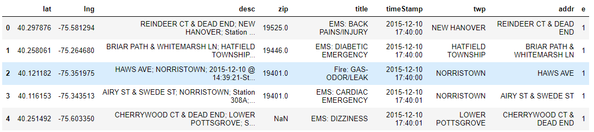
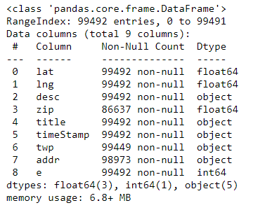
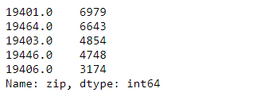
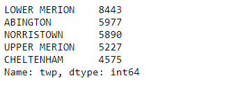
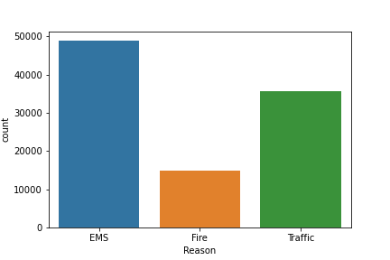

# Emergency-911-Calls-Fire-Traffic-EMS-for-Montgomery-County-PA
For this project I will be analyzing some 911 call data from [Kaggle](https://www.kaggle.com/mchirico/montcoalert). The data 
contains the following fields:

* lat : String variable, Latitude
* lng: String variable, Longitude
* desc: String variable, Description of the Emergency Call
* zip: String variable, Zipcode
* title: String variable, Title
* timeStamp: String variable, YYYY-MM-DD HH:MM:SS
* twp: String variable, Township
* addr: String variable, Address
* e: String variable, Dummy variable (always 1)

## Technology Used 
### Python Libraries 
  * pandas library
  * numpy Library
  * matplotlib
  * seaborn

## Process 
### analysis

I used pandas to read in the csv data set from Kaggle to create a dataframe and analyse the data

```python
data = pd.read_csv('data/911.csv')
data.head()
```


Check out the info() of the df
```python
data.info()
```


I needed to change the dtype of the Timestamp column to DateTime object using pd.to_datetime to make it easier to create plots using dates
```python
data['timeStamp'] = pd.to_datetime(data['timeStamp'])
```

#### Questions

What are the top 5 zipcodes for 911 calls?
```python
data['zip'].value_counts().head(5)
```


What are the top 5 townships(twp) for 911 calls?
```python
data['twp'].value_counts().head(5
```


### Visualization

I used seaborn/matplotlib to visualize portions of the data

#### Questions
What are the most common reasons for a 911 call?

In order to answer this question I used .apply() with a lambda exprssion to create a new column called "reason" that conatins the reason string from the titles column 

```python
data['Reason'] = data['title'].apply(lambda title: title.split(':')[0])
```

and then used  seaborns countplot to visualize the most common reasons for a 911 call.

```python
sns.countplot(x='Reason', data=data)
plt.savefig("images/reasons.png")
```



